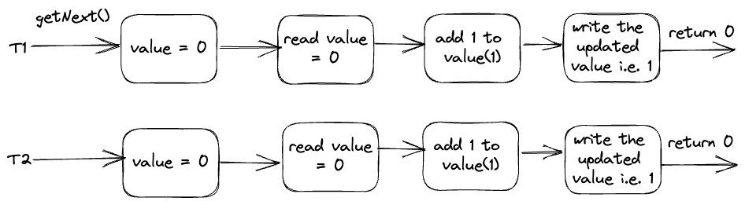

# Chapter 1: Introduction

Threads help porgrammers to use the resources in an effecient manner. But at the same time they come with their own set of challenges, which if ignored can lead to incorrect result. Below are the few challenges associated with using threads for concurrent programming:

#### Safety hazards
If multiple threads are trying to access the same resource and there is no synchronization involved then the order in which these threads access the resource becomes unpredictable. For example in the below code, when multiple threads try to invoke `getNext`, we can end up getting inconsistency in final result.
```
@NotThreadSafe
public class UnsafeSequence {

    private int value;

    public UnsafeSequence() {
        this.value = 0;
    }

    public int getNext() {
        return value++;
    }
}
```
The `getNext` returns the current value and increments the value by one. With this code, the expectation is that we always get a unique value while invoking `getNext` but that might not be the case when multiple threads are invoking it concurrently. This is because the `++` operator is not atomic but a multi-step operation. It includes the following three operations:
 - Read the current value
 - Add one to it
 - Write the updated value

Now if two threads T1 & T2 invoke the method concurrently, they both can land on step 1 at the same time. Read the same value and in turn return the same value for both the threads which breaks our contract. Also the internal state is corrupted as we have had two invocations of `getNext` but the value is incremented only once.



The above problem is known as **race condition** in the world of concurrent programming. What makes it more challenging is that this behavior is not predictable. This problem might not be evident if we run our code as it depends upon how threads interleave. So writing a test for verifying correctness of our code is in itself a challenge. 

The above problem can be solved by making sure that only one thread can access the internal state for modification. Let us see how can we do this using the `synchronized` keyword
```
@ThreadSafe
public class SafeSequence {

    @GuardedBy("this")
    private int nextValue;

    public SafeSequence() {
        this.nextValue = 0;
    }

    public synchronized int getNext() {
        return nextValue++;
    }
}
```
In above code, the `getNext` method allows only one thread to enter at a time while other threads are blocked. This might not be the most effecient solution but this guarantees the correctness of our program.

#### Liveness hazard
Concurrent programming makes use of measures to ensure that threads don't overstep on each other. But if these measures are not implemented correctly, we can end up in a state where a thread is unable to make progress indefinitely. This will bring our code at halt because we are stuck without any hope of getting unblocked. Again verifying if a code will end up in a liveness failure is not straightforward as it might not be evident in the first few independent executions of the code.

#### Performance hazard
Threads are not free of cost and come with their own overhead. When one thread is suspended by scheduler and another thread is allowed to execute, this involves context switching. Using thread-safe mechanisms such as `synchronized` prevents compiler from doing optimizations such as memory caches. If these factors are not taken into consideration while writing concurrent code then we can end up with a system that will perform poorly in terms of performance. 